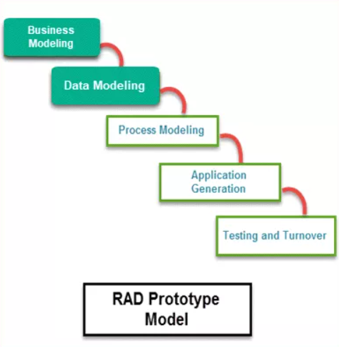

# Tödeb Java Spring Bootcamp Teorik Ödevler

## Ödev 1 

### 1- IOC ve DI nedir ?
 
#### Spring IoC (Inversion of Control - Bağımlılıkların Tersine Çevrilmesi Prensibi): 
Spring Framework'ün çekirdeğidir. Nesneleri yaratır, bağımlılıklarını yapılandırır ve bir araya getirir, tüm yaşam döngülerini yönetir. Kapsayıcı, uygulamayı oluşturan bileşenleri yönetmek için Dependency Injection(DI) kullanır. Bir yapılandırma dosyasından (XML) veya Java Kodundan veya Java Açıklamalarından ve Java POJO sınıfından nesneler hakkındaki bilgileri alır.  Spring IoC'nin temel özelliklerinden bazıları :

- Bizim için Nesne Yaratmak,
- Nesnelerimizi yönetmek,
- Uygulamamızın yapılandırılabilir olmasına yardımcı olmak,
- Bağımlılıkları yönetme.

#### Spring DI (Spring Dependency Injection - Bağımlılıkların Enjekte Edilmesi Deseni) :

enjekte edilme işlemi de IoC Container tarafından gerçekleştirilmektedir. Buradaki enjekte edilme işleminden bahsedilen; bağımlılıkların (nesnelerin, sınıf içerisinde kullanılacak olan yapıların) sınıflara geçilmesi işlemidir. Spring Dependency Injection'ın iki türü vardır: 

- Setter Bağımlılık Enjeksiyonu (SDI)
- Yapıcı Bağımlılığı Enjeksiyonu (CDI)

 Setter Bağımlılık Enjeksiyonu (SDI)

Setter Injection, iki Dependency Injection yönteminden daha basit olanıdır. Bunda Dependency Injection, setter ve/veya getter yöntemleri yardımıyla enjekte edilecektir. Şimdi Bean'de Dependency Injection'ı Setter Injection olarak ayarlamak için bean-configuration dosyası üzerinden yapılır. Bunun için Setter Injection ile ayarlanacak özellik bean-config dosyasında <property> etiketi altında bildirilir.

 Yapıcı Bağımlılık Enjeksiyonu (CDI)

Constructor Injection'da, Dependency Injection, yapıcıların yardımıyla enjekte edilecektir. Şimdi bean'de Dependency Injection'ı Constructor Dependency Injection olarak ayarlamak için, bean-configuration dosyası üzerinden yapılır. Bunun için CDI ile ayarlanacak özellik bean-config dosyasında <constructor-arg> etiketi altında bildirilir.

### 2- Spring Bean Scopes nedir?

Bir bean’in context’i, kullandığımız bağlamlarda o bean’in yaşam döngüsünü ve oluşumunu tanımlar. Spring framework çatısında 6 adet bean scope bulunmaktadır:

- singleton
- prototype

Yalnızca web uyumlu uygulamalar ile kullanılabilen scope’lar ise:

- request
- session
- application
- websocket

### 3- @SpringBootApplication nedir ?

@SpringBootApplication anotasyonu uygulamanın giriş metodunu belirtir. Yani halk arasındaki tabir ile main fonksiyondur. Uygulama bu metod ile başlar.

### 4- Why Spring Boot over Spring?

Spring Boot, standart Spring çerçevesinin tüm işlevlerini içerirken aynı zamanda uygulama geliştirmeyi çok daha kolay hale getirir. Spring ile karşılaştırıldığında, tüm Spring Boot öznitelikleri otomatik olarak yapılandırıldığından, bir uygulamayı çok daha kısa sürede hazır hale getirip çalıştırabilir.

### 5- Singleton nedir ve nerede kullanılır?

Singleton(tek nesne) tasarım kalıbı, bir sınıfın tek bir örneğini almak için kullanılır.Amaç oluşturulan nesneye global erişim noktası sağlamaktır.Sistem çalıştığı sürece ikinci bir örnek oluşturulmaz, böylelikle istenen nesnenin tek bir defa oluşturulması garanti altına alınacaktır.Singleton nesneler ilk çağırıldıklarında bir kere oluşturulurlar ve sonraki istekler bu nesne üzerinden karşılanır.

Çoklu istemcili, örneğin bir web projesindeki nesne için singleton uygulayacaksak oluşturulan ilk örneğin kilitlenmesi gerekmektedir.Eğer kilitleme yapılmazsa iki farklı thread in ard arda yapacağı istek sonucu, birinin sonucuna ulaşamadan yeni bir örneklendirme yapar.Kilitleme yapılırsa nesne örneği kilitli olacağından, oluşturulan ilk örneğin işleminin bitmesini bekler ve ikinci bir istek yapıldığında oluşturulan ilk örneği kullanır.

### 6- Spring Bootda @RestController ek açıklamasını açıklayın?
RestController Nedir
RestController ise @Controller ve@ ResponseBody’nin birleşiminden oluşan bir streotype. Dolaylı olarak da @Controller üzerinden @Component notasyonunu da barındırıyor. @Controller notasyonunun aksine @RestController datanın kendisini JSON veya XML formatı ile direkt olarak sunabiliyor.

### 7- Spring ve Spring Boot arasındaki temel fark nedir?
Spring: bir web uygulaması geliştirmek için en yaygın olarak kullanılan Java EE (Java Enterprise Edition) kütüphanelerinden biridir. Java platformu için ayrıntılı bir programlama ve yapılandırma modeli sunar. Java EE kapsamında uygulama geliştirmeyi basitleştirmeyi amaçlar ve biz geliştiricilerin daha üretken olmasına yardımcı olur.

Diğer kütüphanelerin aksine Spring uygulamanın birkaç alanına odaklanır ve kapsamda birçok özellik sunar. Spring kütüphanesinin en önemli özelliği Dependency Injection dır.

Spring Boot: Spring kütüphanesi bize esneklik uygulamaya odaklanırken, Spring Boot kod uzunluğunu kısaltmayı ve bir web uygulaması geliştirmenin en kolay yolunu bize sunmayı amaçlamaktadır. Spring Boot, uygulama geliştirme için gerekli olan süreyi bir hayli kısaltır. Neredeyse hiçbir konfigürasyon yapmadan tek başına bir uygulama oluşturulmasına yardımcı olur.

Oto konfigürasyon Spring Boot için özel bir özelliktir.

### 8- VSC nedir neden kullanılır?
Versiyon Kontrol Sistemi (VCS), revizyon kontrol (revision control) veya kaynak kontrol (source control) diye de geçip, değişiklik yönetim sistemi anlamına gelmektedir.  Bir ya da daha fazla dosya üzerinde yapılan değişiklikleri kaydeden ve daha sonra belirli bir sürüme geri dönebilmenizi sağlayan bir sistemdir.

“Sürüm kontrolü” terimi genellikle programcılarla ilişkilendirilirken, yazarlar, gazeteciler ve hatta üniversite öğrencileri için de aynı derecede önemlidir. Belge revizyonlarını ve sürümlerini otomatik olarak takip eden yaygın hizmetlere örnekler arasında Google Docs ve DropBox bulunur. 

Bir dosyanın değişik sürümlerini korumak istiyorsanız, Sürüm Kontrol Sistemi (VCS) kullanmanız çok akıllıca olacaktır. VCS, dosyaların ya da bütün projenin geçmişteki belirli bir sürümüne erişmenizi, zaman içinde yapılan değişiklikleri karşılaştırmanızı, soruna neden olan şeyde en son kimin değişiklik yaptığını, belirli bir hatayı kimin, ne zaman sisteme dahil ettiğini ve daha başka pek çok şeyi görebilmenizi sağlar. Öte yandan, VCS kullanmak, bir hata yaptığınızda ya da bazı dosyaları yanlışlıkla sildiğinizde durumu kolayca telâfi etmenize yardımcı olur. Üstelik, bütün bunlar size kayda değer bir ek yük de getirmez.

### 9- SOLID İlkeleri nelerdir? Java'da örnek kullanımlar verir misiniz?

SOLID, yazılım tasarımlarını daha anlaşılır, esnek, sağlam ve sürdürülebilir hale getirmeyi amaçlayan 5 tasarım ilkesinin kısaltmasıdır . Bu uygulamaları benimsemek, kod kokularının önlenmesine de katkıda bulunabilir.

5 SOLID ilkesi şunlardır:

- S - The single-responsibility principle
- O - The open-closed principle
- L - The Liskov substitution principle
- I - The interface segregation principle
- D - The dependency inversion principle

##### 1. Single Responsibility Principle (Tek Sorumluluk İlkesi)
  *“Bir sınıfın yalnızca bir sorumluluğu olmalı”*

Başka bir deyişle, bir sınıfı yalnızca bir amaç için yazmalı, değiştirmeli ve korumalıyız. Eğer bu model sınıfı ise yalnızca bir oyuncuyu yada varlığı temsil etmelidir. Bu, bize başka bir varlığa ait değişikliklerinin etkilerinden endişe etmeden gelecekte değişiklik yapma esnekliği sağlayacaktır.


```java
public class Kitap {
    String baslik;
    String yazar;

    String getBaslik() {
        return baslik;
    }
    void setBaslik(String baslik) {
        this.baslik = baslik;
    }
    String getYazar() {
        return yazar;
    }
    void setYazarString yazar) {
        this.yazar = yazar;
    }
    void kitapAra() {...}
}

```
Kitap sınıfında Tek Sorumluluk İlkesini ihlal eder şekilde iki sorumluluk mevcut.

```java

public class Kitap {
    String baslik;
    String yazar;

    String getBaslik() {
        return baslik;
    }
    void setBaslik(String baslik) {
        this.baslik = baslik;
    }
    String getYazar() {
        return yazar;
    }
    void setYazar(String yazar) {
        this.yazar = yazar;
    }
}

```

```java
public class Envanter{
    Kitap kitap;

    Envanter(Kitap kitap) {
        this.kitap = kitap;
    }

    void KitapAra() {...}
}
```   

##### 2. Open Closed Principle (Açık Kapalı İlkesi)
   Bu, uygulamamızı tasarlarken aklımızda tutmamız gereken ikinci önemli kuraldır. Açık kapalı prensibi: *“Yazılım bileşenleri geliştirme  için açık, ancak değişiklik için kapalı olmalıdır.”*

##### 3. Liskov’s Substitution Principle(Liskov Değiştirme Prensibi)
Bu ilke daha önce tartışılan açık kapalı ilkenin bir çeşididir.

“Türetilmiş tipler, temel tipleri için tamamen değişken olmalıdır”

Bu, sınıfımızı genişleten yazılımcılar ek bir efor sarfetmeden sınıflarımızı uygulayabilmeleri gerekir. Bu, alt sınıflarınızın nesnelerinin, üst sınıfınızın nesneleriyle aynı şekilde davranmasını gerektirir. Bir üst sınıfın nesnesinin uygulamada sorunlara neden olmadan alt sınıflarının nesneleri tarafından değiştirilebilmesi gerektiğini belirtir. Özellikte bu metotlarda instanceof gibi nesnelerin tipleri arasında kıyaslama yapılmak zorunda kalındığı zaman, LSP prensibi çiğnenmiş olur ki, bu alt sınıfların varlığından haberdar olunduğu anlamına gelir. İdeal olan ise kullanıcı sınıfları alt sınıfların varlığını bilmesidir.


##### 4. Interface Segregation Principle(Arayüz Ayrıştırma İlkesi)
Arayüzlere sınıflara ait tek sorumluluk ilkesi olduğu için uygulanabilir.

*“Kullanıcılar, kullanmayacakları gereksiz yöntemleri uygulamaya zorlanmamalıdır”*

##### 5. Dependency Inversion Principle(Bağımlılıkları Ters Çevirme)
Yazılımımızı, birbirlerini bağlamak için soyut bir katman kullanarak çeşitli modüllerin birbirinden ayrılabileceği şekilde tasarlamalıyız.

Başka bir deyişle, üst ve alt seviye sınıflarını ayırmanız gerekir. Yüksek seviye sınıfları genellikle karmaşık mantığı içine alırken, düşük seviye sınıfları veri veya yardımcı programları içerir. Tipik olarak, çoğu insan yüksek seviye dersleri yapmak ister, düşük seviye derslerine bağlıdır. Ancak, Bağımlılık İnversiyon Prensibi’ne göre, bağımlılığı tersine çevirmeniz gerekir. Aksi halde, düşük seviye sınıfı değiştirildiğinde, yüksek seviye sınıfı da etkilenecektir.

Çözüm olarak, düşük seviyeli sınıflar için soyut bir katman oluşturmanız gerekir, böylece yüksek seviyeli sınıflar somut uygulamalardan ziyade soyutlamaya bağlı olabilir.

### 10- RAD modeli nedir?

RAD Modeli veya Hızlı Uygulama Geliştirme modeli, herhangi bir özel planlama olmaksızın prototiplemeye dayalı bir yazılım geliştirme sürecidir. RAD modelinde, planlamaya daha az dikkat edilir ve geliştirme görevlerine daha fazla öncelik verilir. Kısa sürede yazılım geliştirmeyi hedefler.

SDLC RAD modellemesinin aşağıdaki aşamaları vardır

- İş modeli
- Veri Modelleme
- Süreç Modelleme
- Uygulama Üretimi
- Test ve Ciro



